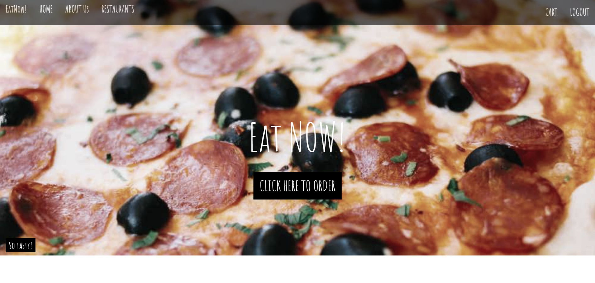
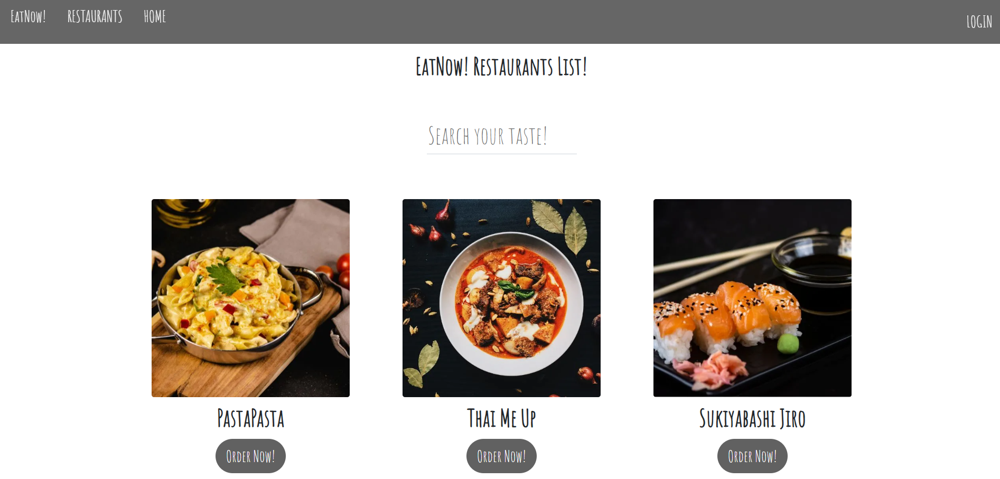
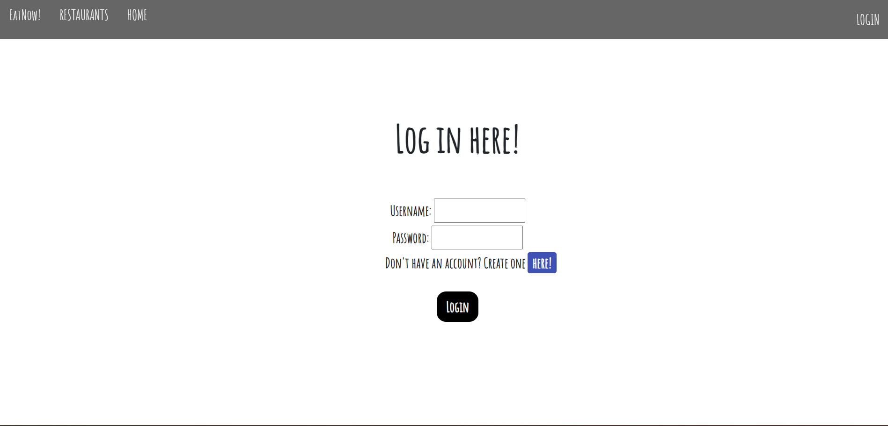

# EatNOW!
> The Food Ordering Application is a web-based platform designed to facilitate the process of ordering food from various restaurants. Users can browse through a wide range of restaurants, view their menus, and place orders!

## Table of Contents
* [General Info](#general-information)
* [Backend Technologies Used](#backend-technologies-used)
* [Frontend Technologies Used](#frontend-technologies-used)
* [Screenshots](#screenshots)
* [Contact](#contact)
* [Setup](#setup)
* [Features](#features)
* [Authors](#authors)

## General Information
The purpose of our project is to provide users with a user-friendly platform where they can easily explore different restaurants, view menus, place orders, and make secure online payments, all in one place. By centralizing the food ordering process, our application aims to save users time and effort while enhancing their overall experience.

We undertook this project because we recognized the growing demand for convenient and efficient food delivery services, especially in today's fast-paced world where people often seek quick and hassle-free solutions for their everyday needs. 

## Backend Technologies Used
- Python - version 3.11.3
- Django - version == 5.0.1 

## Frontend Technologies Used
- HTML5
- CSS
- JavaScript
- Bootstrap

## Screenshots
#### Homepage

#### Menu

#### Login

## Contact
Find me on LinkedIn: https://www.linkedin.com/in/wiktoria-spicha-junior-it-recruiter/ 
- feel free to contact me!

## Setup
1. Clone the repository to your local computer

       $ git clone 'https://github.com/spiwik98/EatNow---SDA-Project.git'

2. Navigate to project directory

       $ cd customer

3. Create virtual environment

       $ python -m venv venv

      activate for windows
        
        $ python venv\Scripts\activate

      activate for Linux

        $ source venv/bin/activate
     

4. Install the required dependencies

        $ pip install -r requirements.txt

5. Create database 'db.sqlite3' using migration

        $ python manage.py migrate
   

6. Run the Django development server

        $ python manage.py runserver 

    Our server will be available at http://localhost:8000/

## Features
* Browsing Restaurants: Users have the ability to browse a list of restaurants, sorting them by cuisine type or restaurant name, facilitating finding their favorite spot or discovering new flavors.
* Ordering Food: Users can freely browse restaurant menus, select dishes, add them to their cart, and easily place orders online, ensuring convenience and speed in the ordering process.
* Login Panel: Access to placing orders is restricted to logged-in users, ensuring data security and a personalized shopping experience.
* Registration: Users have the option to register on the platform, which allows access to additional features such as placing orders and confirming 

#### To do
  * Loyalty Program: The platform may offer a loyalty program where users can accumulate points for orders, which they can later redeem for discounts.
  * Special Requests Handling: Users will have the ability to add special instructions or modify their orders, such as requests for extra ingredients or excluding specific items.
  * Online Payments: The platform will also support online payments, enabling users to securely pay for their orders using various payment methods such as credit cards, digital wallets, or other online payment gateways.

# Authors
  ## Wiktoria Spicha
  ## Katarzyna Ogiela
  ## Adrian Kowalski
